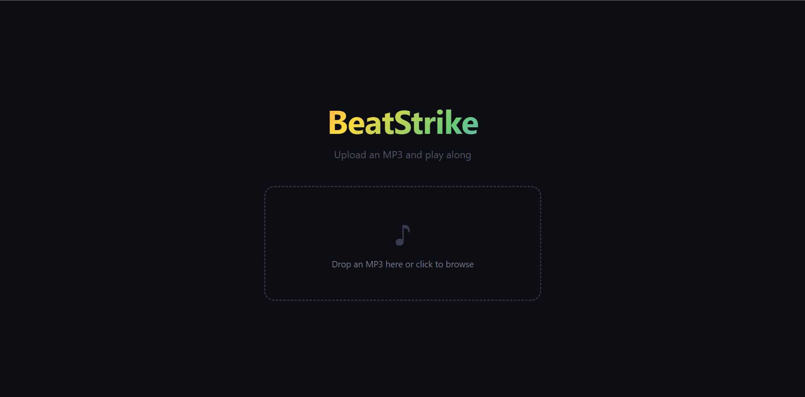
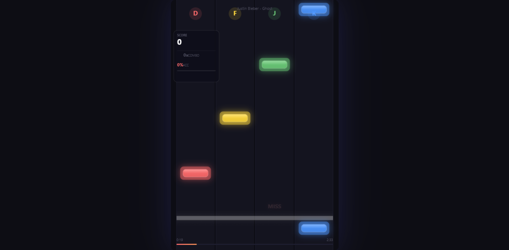
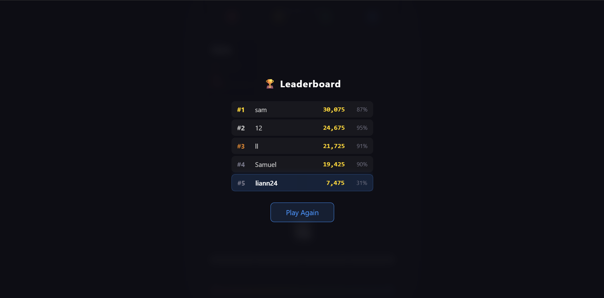

# 🎵 BeatStrike

**A 4-lane browser rhythm game.** Upload any MP3 — beats are detected automatically — and play instantly. No backend, no beatmap files, no setup.

▶ **[Play it live on Vercel](https://personal-project-xi-coral.vercel.app/)**

---

## 📸 Screenshots

| Start Screen | Gameplay | Leaderboard |
|:---:|:---:|:---:|
|  |  |  |

---

## 🎮 How to Play

1. **Upload an MP3** — drag & drop or click to pick a song
2. **Wait for beat detection** — the game analyzes the audio in your browser
3. **Press the keys** as notes fall down the four lanes:

| Lane | Key |
|------|-----|
| Left-1 | **D** |
| Left-2 | **F** |
| Right-1 | **J** |
| Right-2 | **K** |

### Scoring

- **Perfect** — precise timing
- **Good** — close timing
- **Miss** — you let the note slip

Combo streaks multiply your score. Check the leaderboard for your best runs per song.

---

## ✨ Features

- 🎧 **Any MP3 becomes a playable level** — beat detection via Web Audio API
- 🖥️ **Runs entirely in the browser** — no server, no uploads, no signup
- 🏆 **Per-song leaderboard** — high scores saved with localStorage
- 🎨 **Glassmorphism UI** — combo counter, hit effects, lane flash, animated score
- ⚡ **Instant play** — just upload and go

---

## 🛠️ Tech Stack

| Layer | Technology |
|-------|------------|
| Framework | React 19 + Vite 8 |
| Rendering | HTML5 Canvas |
| Audio | Web Audio API (AnalyserNode, beat detection) |
| Styling | CSS (glassmorphism, animations) |
| Storage | localStorage (leaderboard) |
| Hosting | Vercel (static deploy, `vite build`) |

---

## 🚀 Run Locally

```bash
# Clone the repo
git clone https://github.com/Samm24TT/Personal-Project.git
cd Personal-Project

# Install dependencies
npm install

# Start dev server
npm run dev

# Build for production
npm run build
```

---

## 📁 Project Structure

```
src/
├── App.jsx              # Root component — song upload + game mount
├── App.css              # Glassmorphism layout styles
├── main.jsx             # Vite entry point
├── index.css            # Global styles
├── constants.js         # Timing windows, scoring, lane config
├── components/          # React UI components (score, leaderboard, etc.)
├── engine/              # Game loop, canvas renderer, beat detection
└── assets/              # Static assets

.claude/
├── skills/rhythm-game/SKILL.md    # Claude Code skill for rhythm game dev
└── agents/beatmap-generator.md    # Claude Code agent for beat detection
.mcp.json                           # MCP filesystem server config
```

---

## 🤖 Built with Claude Code

This project was built as a ch-3 personal project using Claude Code. It demonstrates:
- **MCP** — `.mcp.json` filesystem server for reading/writing project files
- **Skill** — `.claude/skills/rhythm-game/SKILL.md` with game dev patterns
- **Agent** — `.claude/agents/beatmap-generator.md` for Web Audio API beats

---

## ⭐ Support

If you find this project interesting, give it a star — it helps show this is a real, shared project.

---

*Built by [@Samm24TT](https://github.com/Samm24TT)*
